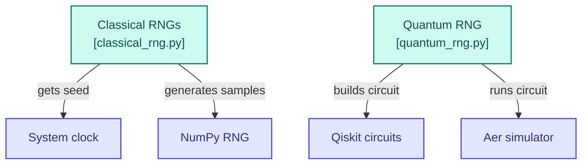

# QuantumRNG

Small RNG scripts designed to compare Classical vs Quantum RNG algorithms

# Architecture

```mermaid
%% Generated by https://gitdiagram.com/ajlrza/quantumrng
flowchart TD

node_classical["Classical RNGs<br/>[classical_rng.py]"]
node_quantum["Quantum RNG<br/>[quantum_rng.py]"]
node_clock["System clock"]
node_numpy["NumPy RNG"]
node_qiskit["Qiskit circuits"]
node_aer["Aer simulator"]

node_classical -->|"gets seed"| node_clock
node_classical -->|"generates samples"| node_numpy
node_quantum -->|"builds circuit"| node_qiskit
node_quantum -->|"runs circuit"| node_aer

click node_classical "https://github.com/ajlrza/quantumrng/blob/main/classical_rng.py"
click node_quantum "https://github.com/ajlrza/quantumrng/blob/main/quantum_rng.py"

classDef toneNeutral fill:#f8fafc,stroke:#334155,stroke-width:1.5px,color:#0f172a
classDef toneBlue fill:#dbeafe,stroke:#2563eb,stroke-width:1.5px,color:#172554
classDef toneAmber fill:#fef3c7,stroke:#d97706,stroke-width:1.5px,color:#78350f
classDef toneMint fill:#dcfce7,stroke:#16a34a,stroke-width:1.5px,color:#14532d
classDef toneRose fill:#ffe4e6,stroke:#e11d48,stroke-width:1.5px,color:#881337
classDef toneIndigo fill:#e0e7ff,stroke:#4f46e5,stroke-width:1.5px,color:#312e81
classDef toneTeal fill:#ccfbf1,stroke:#0f766e,stroke-width:1.5px,color:#134e4a
class node_classical,node_quantum toneTeal
class node_clock,node_numpy,node_qiskit,node_aer toneIndigo
```
